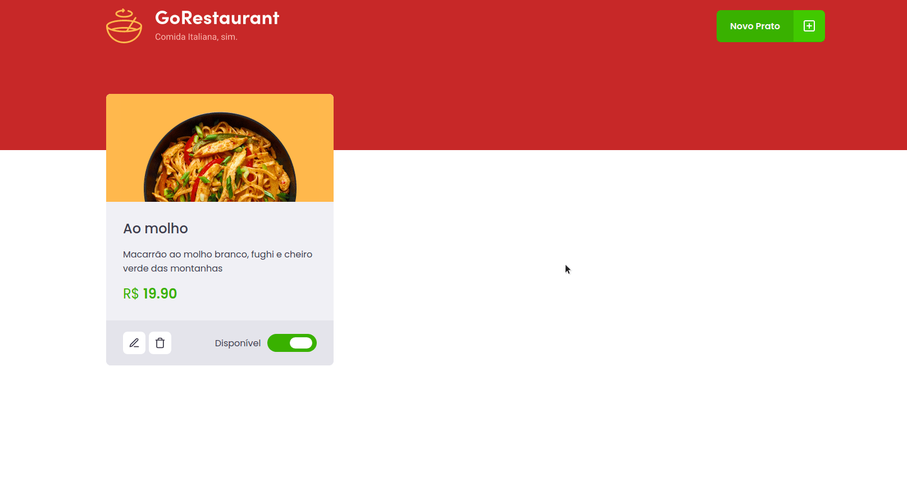

# :pizza: GoRestaurant App

:rocket: Desafio 02 proposto no módulo 2 do Ignite (Rocketseat) onde é trabalhada a transposição da aplicação que antes estava completamente em **_JavaScript_** utilizando _Class Components_ para **_TypeScript_**, utilizando _Function Componentes_.

#### Funcionalidades

- Buscar produtos da FakeAPI (**_JSON Server_**);
- Adicionar novos pratos;
- Remover pratos;
- Editar pratos já adicionados;

